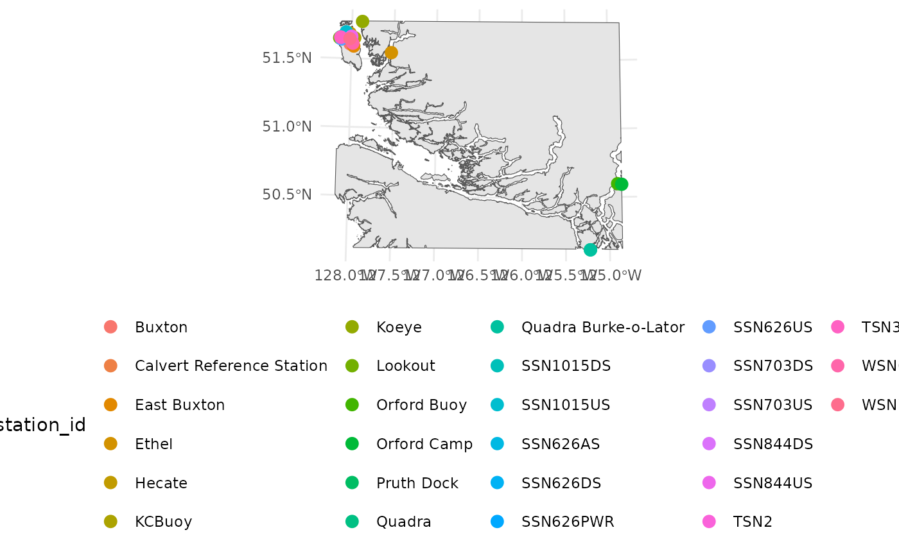

# Viewing Recent Stations

One of the endpoints accessed by the `hakaiApi` package is the stations
endpoint. This endpoint provides metadata about stations, including
their geographic coordinates. This information can be useful for
visualizing the locations of stations on a map. In R we can either make
static maps using `ggplot2` or interactive maps using `mapview` to
quickly visualize the locations of stations. We need to install the
`bcmaps` package to get a base map of British Columbia as well as the
`sf` package to handle spatial data and the `ggplot2` and `mapview`
packages for visualization.

``` r
library(hakaiApi)
library(ggplot2)
library(mapview)
library(bcmaps)
#> Loading required package: sf
#> Linking to GEOS 3.12.1, GDAL 3.8.4, PROJ 9.4.0; sf_use_s2() is TRUE
#> Support for Spatial objects (`sp`) was removed in {bcmaps} v2.0.0. Please use `sf` objects with {bcmaps}.
library(sf)
```

We first need to access the stations endpoint using the `Client` class
from the `hakaiApi` package. We can then use the `get_stations` method
to retrieve a data frame of stations. If you don’t have the sf package
installed you will prompted to install that at this point.

``` r
hakai_client <- hakaiApi::Client$new("https://portal.hakai.org/api")
stations <- hakai_client$get_stations()
```

Because we want to plot the stations and some sensible basemap, we need
to created a clipped polygon of British Columbia that contains all the
stations. We can do this by creating a bounding box around the stations
and then using the `st_intersection` function from the `sf` package to
clip the BC polygon to that bounding box.

``` r
bc <- bcmaps::bc_bound_hres()
#> Creating directory to hold bcmaps data at /home/runner/.cache/R/bcmaps
#> Reading the data using the read_sf function from the sf package.

points_bbox <- st_bbox(stations) |> 
  st_as_sfc() |> 
  st_transform(st_crs(bc))
clipped_polygon <- st_intersection(bc, points_bbox)
```

Once we have the clipped polygon, we can plot the stations on top of it
using `ggplot2` or `mapview`. Here is an example of a static map using
`ggplot2`:

``` r
ggplot() +
  geom_sf(data = clipped_polygon) +
  geom_sf(data = stations, aes(color = station_id), size = 3) +
  theme_minimal() +
  theme(legend.position = "bottom")
```



And here is an example of an interactive map using `mapview`:

``` r
mapview::mapview(stations)
```
